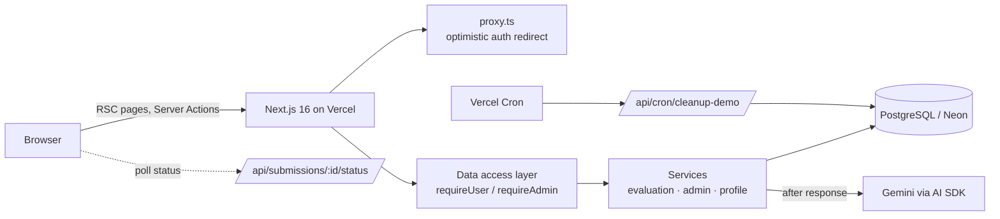

# SkillProof

> **Prove you can apply what you learn.**

SkillProof is an AI-powered practical skill assessment platform for working professionals. Learners solve realistic workplace challenges, an AI grades each submission against an explicit rubric, and every result becomes evidence in a competency profile that shows what they can actually demonstrate, what they struggle with, and what to practise next.

**Live demo:** [skillproof](https://skill-proof-swart.vercel.app/) · Click **Try the demo** for a pre-filled account (no sign-up).

Built by Narendra Kumar Cheemakurthi · [GitHub](https://github.com/Narendra-kumar34) · [LinkedIn](https://www.linkedin.com/in/narendra-kumar-cheemakurthi-9438a9199/)

---

## Contents

- [The problem](#the-problem)
- [What you can do](#what-you-can-do)
- [Tech stack](#tech-stack)
- [Architecture](#architecture)
- [How evaluation works](#how-evaluation-works)
- [Skill profile and gap detection](#skill-profile-and-gap-detection)
- [Key decisions and trade-offs](#key-decisions-and-trade-offs)
- [Security](#security)
- [Real-world considerations](#real-world-considerations)
- [Testing](#testing)
- [Running locally](#running-locally)
- [Deployment](#deployment)
- [Project structure](#project-structure)
- [Limitations and next steps](#limitations-and-next-steps)

---

## The problem

Most learning platforms measure activity: courses completed, videos watched, quizzes passed. None of that shows whether someone can **apply** a skill in a real situation.

SkillProof focuses on that missing step with one loop:

**Learn → Practise → Submit → Evaluate → Identify gaps → Improve**

The MVP covers AI productivity skills (Prompt Engineering, AI Workflow Design, AI-Assisted Data Analysis) with 10 hand-written scenarios and rubrics. The full product brief is in [docs/skillproof.md](docs/skillproof.md).

## What you can do

**As a learner**

- **Learn** from a short concept brief for each skill.
- **Practise** on a realistic scenario in a focused editor that autosaves drafts.
- **Get evaluated** in 10–30 seconds: an overall score, a score per criterion with the evidence behind it, what went well, what to improve, and a recommended next challenge.
- **See progress:** retake a challenge and see the change ("+19 since attempt 1").
- **Build evidence:** a profile per skill with a score for each competency, each linked to the attempts behind it, plus consistency and coverage.
- **Find gaps:** SkillProof detects consistent weak spots across challenges and points you to the challenge that targets them.
- **Manage history:** filter every attempt and draft, and delete what you don't want counted.

**As an admin**

- Full create, edit and delete for skills, competencies, challenges and rubrics, with draft / published / archived states.
- **Server-enforced publishing rules:** a skill needs competencies, and a challenge needs a rubric with 2+ criteria.
- **Rubric versioning:** changes that affect grading bump the version. Past evaluations keep a copy of the rubric they were scored against.
- **Operations overview:** evaluation volume, failure rate, latency and daily AI capacity.

## Tech stack

| Area       | Choice                                                                                                                            |
| ---------- | --------------------------------------------------------------------------------------------------------------------------------- |
| Framework  | **Next.js 16** (App Router, Server Components, Server Actions, Cache Components / Partial Prerendering, typed routes, `proxy.ts`) |
| Language   | **TypeScript** (strict, `noUncheckedIndexedAccess`)                                                                               |
| UI         | **Tailwind CSS v4**, **shadcn/ui** (Radix), lucide icons                                                                          |
| Database   | **PostgreSQL** (Neon) with **Drizzle ORM** and versioned SQL migrations                                                           |
| Auth       | **Better Auth**: email/password, anonymous demo accounts, server-controlled roles, database-backed rate limiting                  |
| AI         | **Vercel AI SDK v7** + **Google Gemini** (structured output validated with Zod)                                                   |
| Validation | **Zod** on every Server Action and API input                                                                                      |
| Testing    | **Vitest** (unit + integration), **Playwright** (end-to-end) with **axe-core** (accessibility)                                    |
| CI/CD      | **GitHub Actions** → **Vercel**                                                                                                   |

## Architecture



- **Layers:** `app/` (routes and UI) → `server/` (session, services, queries, Server Actions) → `domain/` (pure, framework-free logic: scoring, profiles, gaps, recommendations, validation). Everything in `domain/` is unit-tested without a database.
- **Caching:**
  - The published catalogue is cached server-side with `use cache` and the `catalog` tag, which admin edits refresh.
  - Each learner's activity is cached per user (tag `user-activity:<id>`) through unexported functions, so no caller can request another user's data. It refreshes on save, submit and when an evaluation finishes.
  - Pages ship a static shell straight away and stream in the parts that depend on the user.
- **Authentication:** `proxy.ts` only redirects signed-out visitors quickly. The real session check runs in the data access layer on every page and every Server Action.

## How evaluation works

1. **Submit.** The answer is validated (80–12,000 characters) and the draft becomes a numbered, read-only attempt. The work is saved before any AI call.
2. **Evaluate in the background.** The Server Action returns immediately and schedules the evaluation with Next's `after()`. The page shows progress and polls a status endpoint.
3. **Claim atomically.** A conditional `UPDATE … RETURNING` makes sure only one run evaluates a submission, even if triggered twice. A run stuck for over 2 minutes can be taken over.
4. **Prompt.** Gemini receives the scenario, the task, every rubric criterion (weight, competency, and descriptions of strong / adequate / weak work), a shortlist of real next challenges, and the learner's text inside an escaped `<submission>` block marked as untrusted data.
5. **Structured output.** The response must match a Zod schema. Malformed output is retried once; temporary provider errors are retried by the SDK.
6. **Normalise and validate in code.**
   - Every criterion must be scored exactly once, and scores are kept within 0–100.
   - Lists are trimmed and de-duplicated.
   - Off-topic answers are capped at 20.
   - **The overall score is the rubric-weighted mean calculated in code; the AI never sets it.**
7. **Recommend safely.** The AI's pick must be in a deterministic ranking (targets the weakest competency, excludes mastered challenges); otherwise the top-ranked challenge is used.
8. **Persist with provenance.** Each evaluation stores the rubric snapshot and version, model, prompt version and latency. Each run records its outcome and token usage.
9. **Fail gracefully.**
   - Failures are classified: missing key, rate-limited, timeout, invalid output, provider error.
   - The learner sees a safe message and a retry button, and their work is never lost.
   - The app keeps working even with no AI key configured.

## Skill profile and gap detection

Everything is deterministic, explainable and unit-tested ([src/domain/profile.ts](src/domain/profile.ts), [src/domain/gaps.ts](src/domain/gaps.ts)):

- **Latest attempt counts.** Only the latest evaluated attempt on each challenge counts, so the profile reflects current ability and retaking visibly moves it.
- **Competency score:** the weighted mean of every rubric criterion mapped to that competency, using the rubric weights.
- **Evidence:** each competency score links to the attempts behind it. Challenges not yet attempted show as "Not yet".
- **Consistency:** `100 − 2 × standard deviation` of the latest overall scores across challenges (needs 2+).
- **Gap:** a competency averaging **under 60 across 2+ challenges**. The message contrasts it with a well-evidenced strength ("You perform well on instruction clarity, but consistently lose points on robustness: it averages 47 across 3 challenges") and links a challenge that targets it.
- **Next step on the dashboard**, in priority order: close a gap → the latest AI recommendation → continue a draft → a first challenge.

## Key decisions and trade-offs

| Decision                                                                 | Why                                                                                                                                     |
| ------------------------------------------------------------------------ | --------------------------------------------------------------------------------------------------------------------------------------- |
| Overall score calculated in code, not by the AI                          | It always matches the criterion scores the learner sees, and it's auditable.                                                            |
| Gaps and next steps are rule-based                                       | Explainable, testable, no extra AI cost. The AI does the part that needs judgement: grading free text.                                  |
| Evaluations are final; improving means a new attempt                     | Evidence stays honest, and the profile shows growth over time.                                                                          |
| Rubric snapshot and version stored on every evaluation                   | Admins can improve rubrics without silently changing what past scores mean.                                                             |
| Cache Components (Partial Prerendering) turned on                        | Instant static shells with streamed user data; cached catalogue refreshed by tag. Session reads sit behind Suspense boundaries.         |
| No CSP nonces                                                            | Nonces force every page to render dynamically, defeating Partial Prerendering. See [Security](#security).                               |
| Demo accounts are Better Auth anonymous users, pre-filled from seed data | Evaluators see a meaningful profile immediately, each in an isolated account.                                                           |
| Evaluations run after the response, with status polling                  | No serverless timeouts, and learners can leave the page mid-evaluation. A queue (e.g. Inngest, QStash) would be the next step at scale. |
| `role` field instead of Better Auth's admin plugin                       | A smaller attack surface. We need roles, not impersonation or ban endpoints.                                                            |

## Security

- **Authentication:** Better Auth sessions (httpOnly cookies) with a short signed cookie cache. Sign-in, sign-up and demo creation are **rate-limited per IP** in Postgres, so limits hold across serverless instances.
- **Authorization:** checked close to the data.
  - Every page and Server Action calls `requireUser()` or `requireAdmin()`.
  - User data queries always filter by the session's user ID, so another user's submission is simply "not found".
  - Admin pages return 404 to non-admins, and admin actions re-check the role; this was verified with direct action calls.
  - `role` can never be set from sign-up (`input: false`).
- **Input validation:** every Server Action and route handler validates with Zod. Display names are normalised on the server. Redirect targets (`?next=`) are restricted to same-site paths.
- **XSS:** React escapes output, and markdown is rendered **without raw HTML**. The Content-Security-Policy restricts scripts, styles, images, fonts and connections to our own origin, and blocks `object-src`, framing and cross-origin form posts. `'unsafe-inline'` is allowed for scripts because Next's streamed RSC payload needs it without nonces. That's a deliberate trade-off for static prerendering.
- **Other headers:** HSTS, `X-Frame-Options: DENY`, `nosniff`, a strict referrer policy, and a Permissions-Policy. The `X-Powered-By` header is removed.
- **Prompt injection:**
  - The submission is delimited, and any closing tags inside it are escaped.
  - The system prompt says to treat it as data, and suspected manipulation is flagged to the learner.
  - Scores are capped to valid ranges and the overall score is calculated in code.
  - Recommendations are restricted to real challenges.
- **Abuse and cost:**
  - Per-user hourly evaluation limits: 10, or 5 for demo accounts.
  - A global daily cap (400) protects the shared AI key.
  - Deleting work doesn't reset the quota: the usage log outlives submissions.
- **Secrets:** environment variables are validated at startup. The mock AI switch refuses to run in production. The cron endpoint needs a bearer secret, compared in constant time.
- **Data integrity:** foreign keys and check constraints in Postgres, a partial unique index for one draft per challenge, and unique attempt numbers. Learner evidence can't be deleted by deleting a challenge (restricted; archive instead).

## Real-world considerations

- **Resilience:** the app stays usable if the AI provider is down. Submissions are saved first, and failures are classified and retryable. Evaluations stuck for over 2 minutes can be recovered.
- **Scalability:**
  - Stateless serverless functions and a small connection pool per instance, using Neon's pooled connection string.
  - Rate limits live in the database rather than per-instance memory.
  - The shared catalogue is cached, and per-user reads are cached and refreshed precisely by tag.
- **Observability:** every evaluation run is recorded with outcome, error code, latency and tokens, and the admin overview shows the failure rate and capacity. Logs carry IDs and error codes, never learner content.
- **Cost control:** Gemini Flash with low thinking level, bounded output, a daily cap, and a mock provider for all automated tests.
- **Housekeeping:** a daily Vercel Cron deletes demo accounts older than 7 days.
- **Accessibility:**
  - Semantic landmarks and headings, a skip link, labelled controls and a visible focus ring.
  - `aria-live` status updates, and focus moves to the result when an evaluation finishes.
  - Colour is never the only signal: every score band has an icon and a text label.
  - Automated WCAG 2.1 AA checks run with axe in CI.

## Testing

| Suite                      | What it covers                                                                                                                                                                                                                                                      | Command                    |
| -------------------------- | ------------------------------------------------------------------------------------------------------------------------------------------------------------------------------------------------------------------------------------------------------------------- | -------------------------- |
| **Unit** (118 tests)       | Scoring, profile maths, gap detection, next-action priority, recommendation ranking, output normalisation, prompt escaping, error classification, quotas, submission status rules, admin schemas, rubric diffing, safe redirects, seed-content consistency          | `npm test`                 |
| **Integration** (13 tests) | Real services against real Postgres: the evaluation lifecycle, concurrent runs (exactly one evaluation), failure and retry, ownership checks, quota (including after deletes), rubric versioning, publishing rules, delete safeguards, demo cleanup                 | `npm run test:integration` |
| **End-to-end** (17 tests)  | Playwright against a production build: landing page, sign-up/in/out, protected-route redirects, demo dashboard and profile, autosave → submit → result, failure → retry, history filters and delete, admin access denied, **axe accessibility checks on 7 screens** | `npm run test:e2e`         |

CI runs all of these on every push and pull request, along with lint, typecheck, formatting and a schema-drift check. It uses a Postgres service container and the deterministic mock AI (`AI_MOCK=1`).

## Running locally

Requires Node.js 24 (see `.nvmrc`) and a PostgreSQL database (a free [Neon](https://neon.tech) project works).

```bash
npm install
cp .env.example .env.local   # fill in values (see below)
npm run db:migrate           # create tables
npm run db:seed              # skills, challenges, rubrics (+ admin if configured)
npm run dev
```

Open http://localhost:3000 and click **Try the demo**, or create an account.

### Environment variables

| Variable                                   | Required   | Purpose                                                                                       |
| ------------------------------------------ | ---------- | --------------------------------------------------------------------------------------------- |
| `DATABASE_URL`                             | yes        | Postgres connection string (Neon pooled URL)                                                  |
| `BETTER_AUTH_SECRET`                       | yes        | 32+ character secret; generate with `npx auth secret`                                         |
| `BETTER_AUTH_URL`                          | yes        | Public base URL (`http://localhost:3000` locally)                                             |
| `GOOGLE_GENERATIVE_AI_API_KEY`             | for AI     | Gemini key from Google AI Studio. Without it, evaluations fail gracefully and can be retried. |
| `GEMINI_MODEL`                             | no         | Model override (default `gemini-3.8-flash`)                                                   |
| `SEED_ADMIN_EMAIL` / `SEED_ADMIN_PASSWORD` | no         | `db:seed` creates or promotes this admin (password 12+ characters)                            |
| `CRON_SECRET`                              | no         | Turns on the daily demo-cleanup cron (16+ characters)                                         |
| `AI_MOCK`                                  | tests only | `1` uses a deterministic mock model; refused in production                                    |

### Scripts

| Script                                                         | What it does                                                         |
| -------------------------------------------------------------- | -------------------------------------------------------------------- |
| `npm run dev` / `build` / `start`                              | Develop, build, serve                                                |
| `npm run check`                                                | Lint, typecheck, format check and unit tests                         |
| `npm test` · `npm run test:integration` · `npm run test:e2e`   | Test suites (integration and E2E need a seeded database)             |
| `npm run db:generate`                                          | Create a migration after changing `src/db/schema/`                   |
| `npm run db:migrate` · `npm run db:seed` · `npm run db:studio` | Apply migrations · load the catalogue (safe to re-run) · browse data |

For E2E tests with a locally installed browser: `PW_CHANNEL=msedge npm run test:e2e` (or `chrome`).

## Deployment

- **Hosting:** Vercel with its Git integration: previews for pull requests, production for `main`.
- **Migrations** run automatically during the Vercel build (`vercel-build` = `db:migrate && next build`). Seeding is a one-off manual step, so it never overwrites admin edits.
- **Cron:** `vercel.json` schedules `/api/cron/cleanup-demo` daily. Vercel sends the `CRON_SECRET` automatically.
- **Database:** Neon Postgres. Optionally, the Neon Vercel integration gives each preview deployment its own database branch.

## Project structure

```
src/
  app/                 routes: (auth) sign-in/up, (app) dashboard, skills, challenges,
                       history, admin; api/ auth, submission status, cron
  components/          UI: evaluation result, profile, challenge workspace, admin, shadcn/ui
  config/              site and evaluation settings (limits, timeouts, prompt version)
  db/                  Drizzle schema, client, seed content and runner
  domain/              pure logic: scoring, profile, gaps, next action, evaluation
                       (prompt, schema, normalisation, recommendations, errors, quota), admin schemas
  server/              session and data access, services, queries, Server Actions, AI model
  proxy.ts             optimistic auth redirect
drizzle/               versioned SQL migrations
e2e/                   Playwright specs (+ accessibility)
tests/integration/     service tests against Postgres
```

## Limitations and next steps

- **Background work:** `after()` is simple and fits serverless, but a durable queue would add scheduled retries and backpressure at scale.
- **Scoring consistency:** evaluations use one model call per submission. Grading each submission several times and taking the median, or calibrating against reference answers, would reduce variance.
- **Keeping demo progress:** anonymous demo users can't yet turn into full accounts. Better Auth supports linking accounts, and the data model already allows it.
- **More skills and assessment formats**, e.g. file uploads, or multi-step challenges for workflows.
- **Dark mode:** colour tokens for dark mode exist, but there's no theme switch yet.
